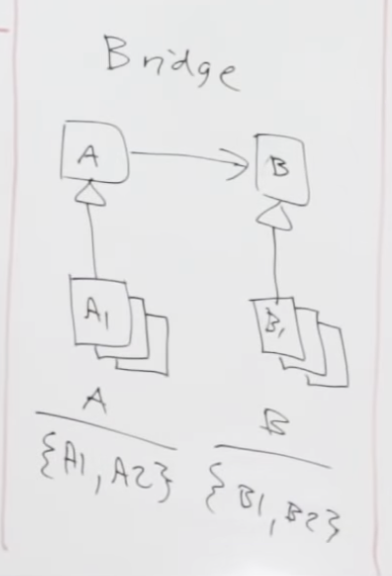

### Most - strukturalny wzorzec projektowy

### **po co?:**
1. rozdzielamy duza klase lub zestaw spokrewnionych klas na dwie polimorficzne hierachie - abstrakcje oraz implementacje. Nad obiema można wówczas pracować niezależnie.
2. mozezemy laczyc/kombinowac kazda konkretna implementacje(1sza hierachia) z inna konkretna implementacja(2ga hierarchia) tworzac pary

