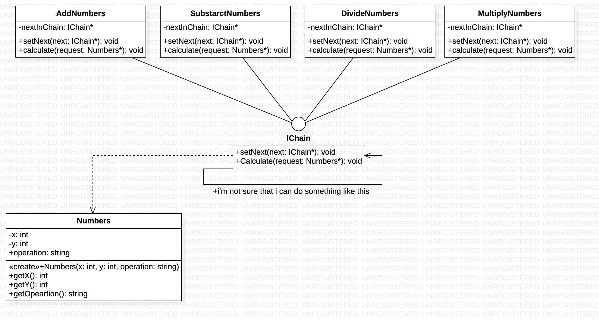

### Łańcuch odpowiedzialności - czynnosciowy wzorzec projektowy

### **po co?:**
1. jesli trzeba przekazywac zadanie wzdluz lancucha.
2. setNext(next:Chain), Handle(request)
3. Jak wiele innych wzorców behawioralnych, Łańcuch Zobowiązań zakłada przekształcenie pewnych obowiązków w samodzielne obiekty zwane obiektami obsługującymi. tzn. kazde sprawdzenie to beda osobne klasy, posiadajace jedna metode dokonujaca sprawdzenie.

