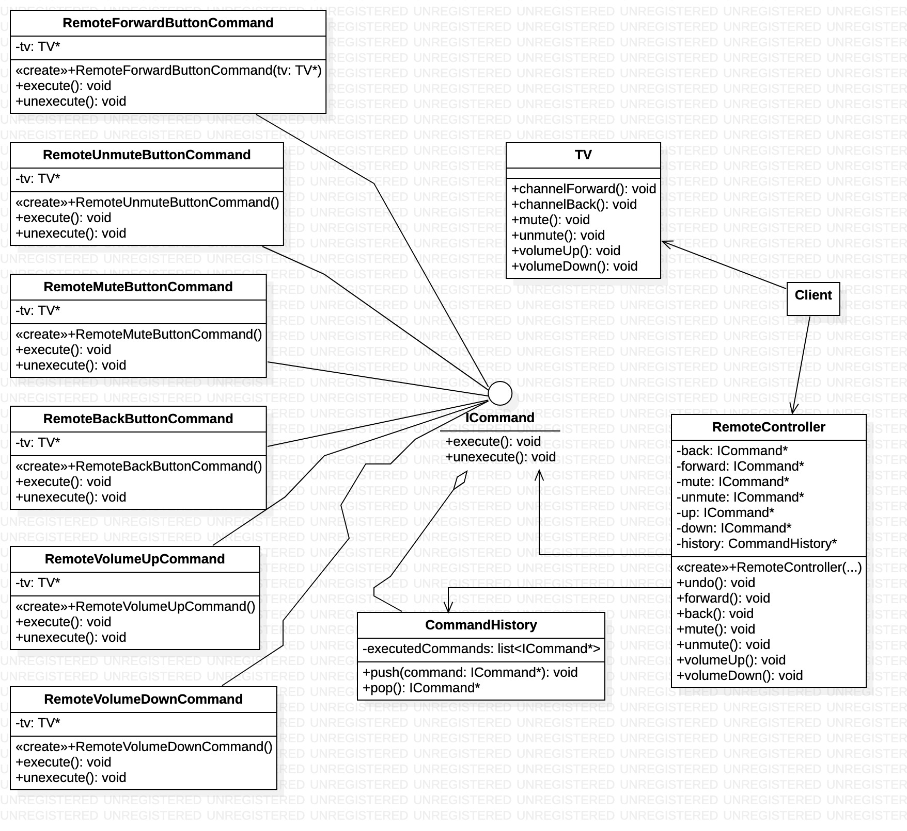

### Polecenie - czynnosciowy wzorzec projectowy

### **po co?:**
1. opoznianie, kolejkowanie, cofanie operacji.
2. Enkapsulujemy operacje. Umieszczajac operacje w jednym miejscu mozemy korzystac z niej w rozniych miejscah programu, gdzie jest na to potrzeba.

