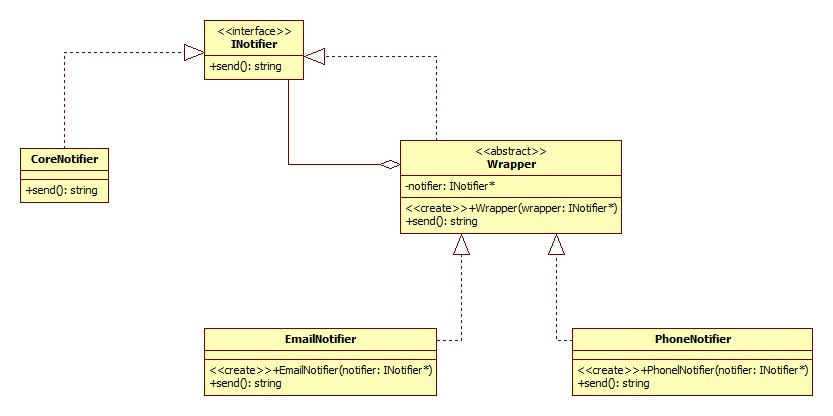

### Dekorator - strukturalny wzorzec projektowy

### **po co?:**
1. chcemy przypisywac obiektom nowe obowiazki w trakcie dzialania programu 
2. kiedy rozszerzenie zakresu obowiazkow obiektu za pomoca dziediczenia jest niepraktyczne lub niemozliwe

