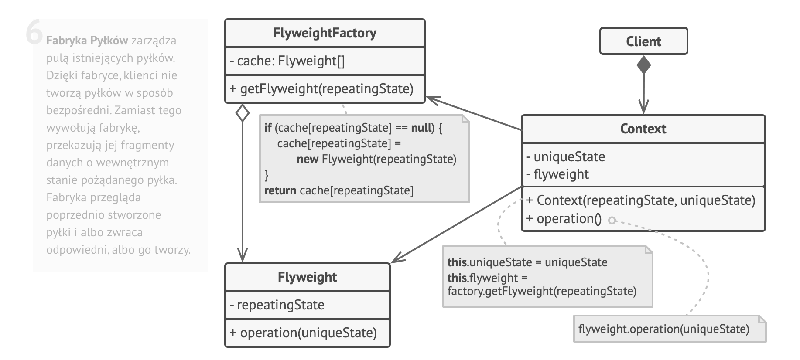

### Pylek - strukturalny wzorzec projektowy

### **po co?:**
1. Istotą omawianego wzorca jest zaprezentowanie prostego mechanizmu współdzielenia wielu obiektów o niewielkim rozmiarze w celu zwiększenia wydajności systemu pod względem zużycia pamięci. Pyłek zajmuje się udostęp- nianiem pojedynczego obiektu wielu klientom.
2. pozwala zmieścić więcej obiektów w danej przestrzeni pamięci RAM poprzez współdzielenie części opisu ich stanów.
3. Wzorzec Pyłek jest jedynie optymalizacją
4. korzystamy z juz wczesniej stworzonych obiektow zamiast tworzneia nowych.

