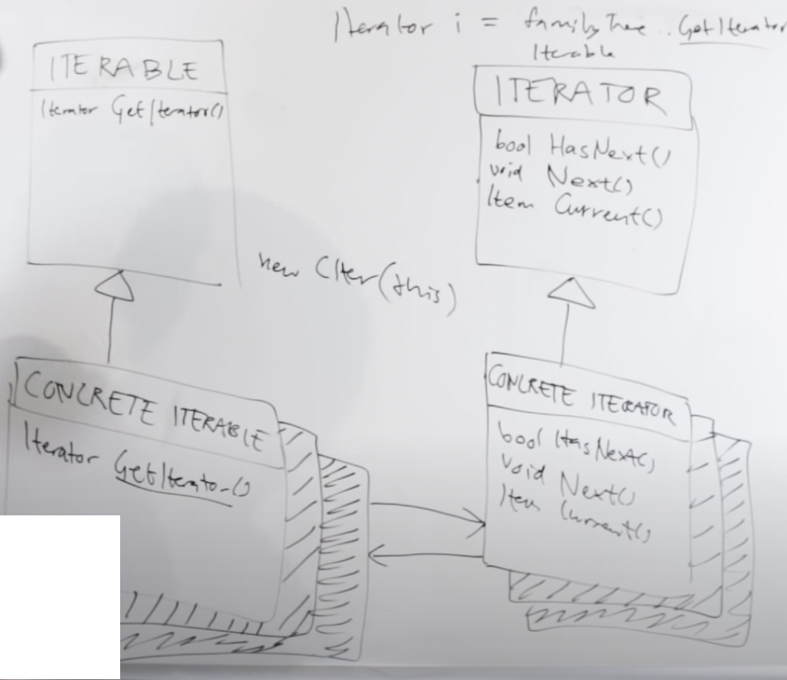

### Iterator - czynnosciowy wzorzec projektowy

### **po co?:**
1. pozwalay sekwencyjnie przechodzić od elementu do elementu jakiegoś zbioru bez konieczności eksponowania jego formy (lista, stos, drzewo, itp.)

