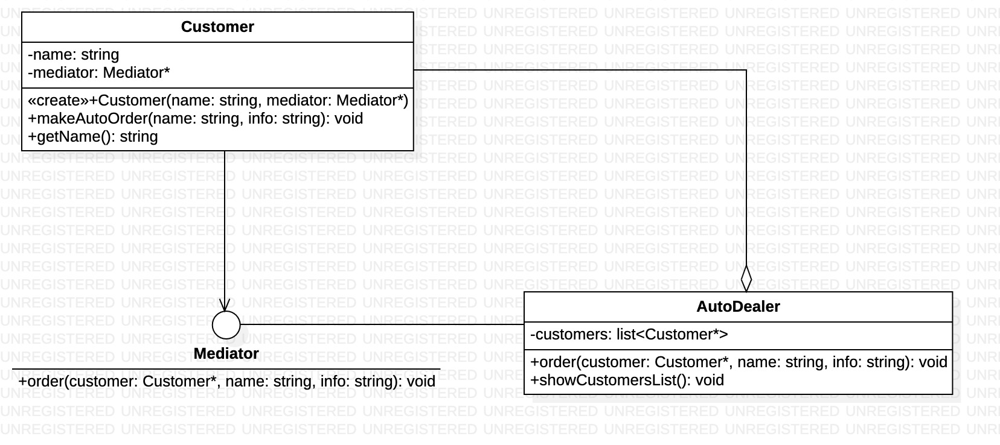

### Mediator - czynnosciowy wzorzec projectowy

### **po co?:**
1. porzadkuje komunikacje miedzy obiektami ktore realizuja wspolny interfejs
2. jakies obiektu realizuja wspolny interfejs i chca komunikowac sie i wykonywac zadanie wspolnie
3. zmniejsza powiazanie miedzy klasami
4. przenosi miedzyklasowe polaczenia w jedna klase(mediator) 
5. pozwala enkasulowac logike i ponownie korzystac z napisanych komponentow

