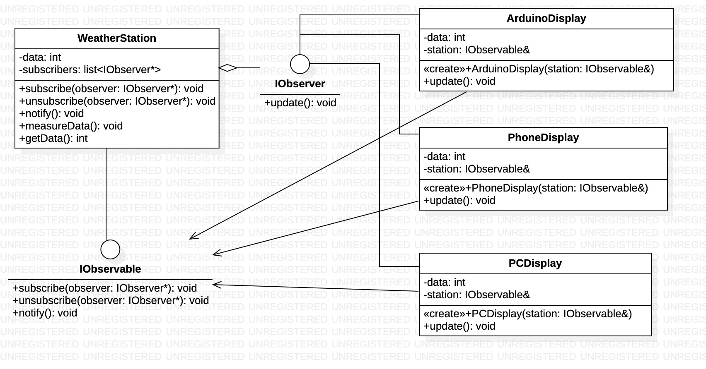

### Obserwator - czynnosciowy wzorzec projektowy

**prawidlowa relacja jeden do wielu**

### **po co?:**
1. definiuje mechanizm subskrypcji w celu powiadamiania wielu obiektów o zdarzeniach dziejących się w obserwowanym obiekcie.

