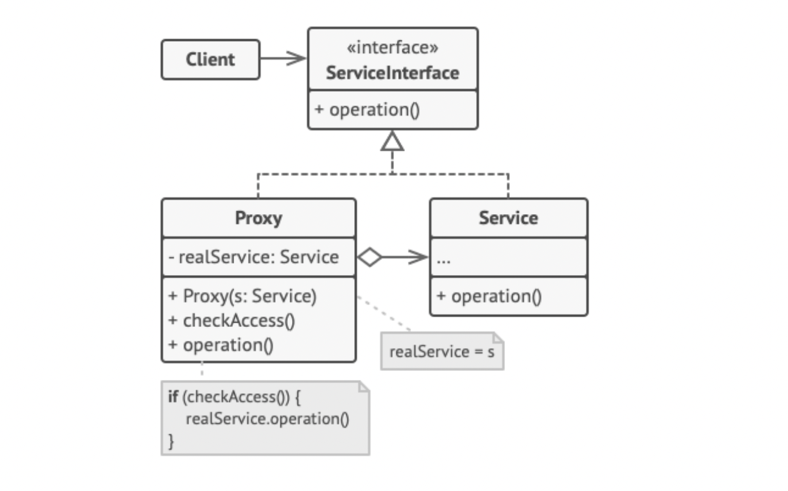

### Proxy - strukturalny wzorzec projektowy

### **po co?:**
1. nie chcemy zeby uzytkownik odwolywal sie do funkcjonalnosci bezposrednio
2. Pełnomocnik nadzoruje dostęp do pierwotnego obiektu, pozwalając na wykonanie jakiejś czynności przed lub po przekazaniu do niego żądania.

