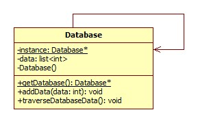

### Singleton - kreacyjny(tworzenie obiektow) wzorzec projectowy

### **po co?:**
-chcemy miec tylko jedno instancje klasy w calym programie. Pozwala na dostep do tej instancji w przestrzeni globalnej(pozwala skorzystac z tego obiektu w dowolnym miejscu programu)

