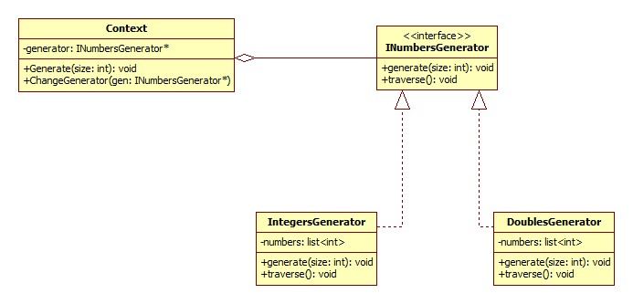

### Strategia - behawioralny(tzn. ta rodzina wzorcow definuje algorytmy i sposoby interakcji klas i obiektow ze soba) wzorzec projektowy

### **po co?**\:
1. strategia enkapsuluje(pozwala laczyc dane i metody w klasie) pewne algorytmy lub zachowania i pozwala je wymieniac/zamieniac.
2. mamy wyniesc logike
3. w runtimie mamy wymieniac jakos logike

