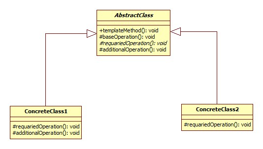

### Metoda szablonowa - czynnosciowy wzorzec projektowy

### **po co?:**
1. np. mamy pewien algorytm ktory ma pewien szkielet. Ale pewne etapy tego algorytmu moga sie roznic. Wiec enkapsulujemy te etapy w oddzielne klasy i tam je inplementujemy. Potem do tego algorymu mozemy podstawiac zaimplementowane etapy jak chcemy -_-

